## Objectif  

Créer un environnement Active Directory fonctionnel pour comprendre :  
- gestion des utilisateurs  
- gestion des machines  
- stratégies de sécurité (GPO)

---
## Architecture

- 1 serveur : contrôleur de domaine (Windows Server 2022)  
- 1 client : machine utilisateur (Windows 10)

---
## Stack  

- VMware  
- Windows Server 2022  
- Windows 10

---
## Création VM Windows Server 2022
### Specs

![[AD-DC-Specs.png]]

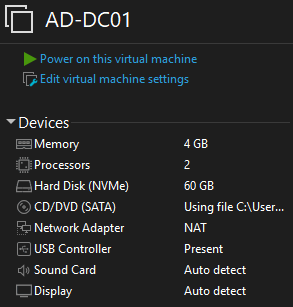

### Décisions d'installation

- Datacenter Desktop Experience choisi pour interface graphique + fonctionnalités AD  
- Réseau NAT pour simplicité et isolation lab

### Problèmes / Solutions  

| Problème                     | Solution                     |
| ---------------------------- | ---------------------------- |
| Easy Install → clé bloquante | VM Custom + Install OS later |
| EFI network timeout          | F2 → Boot CD/DVD first       |

---
## Configuration réseau Windows server 2022

Settings -> Network -> Ethernet -> IP settings : Manual

![[AD-DC-IP-settings.png]]

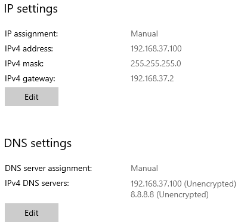

ping vers DNS 192.168.37.100✅
ping vers Gateway 192.168.37.2 ✅

---
## AD DS

Server manager -> Manage -> Add Roles and Features -> Active Directory Domain Service

---
## AD DS Promotion vers AD DC

### Deployment Configuration

**Différences entre les options de déploiement**

| Option                            | Quand                                      | Effet concret                                                    | Exemple                            |
| --------------------------------- | ------------------------------------------ | ---------------------------------------------------------------- | ---------------------------------- |
| **Add DC to existing domain**     | Redondance ou performance                  | 2ème DC dans **le même domaine**, partage utilisateurs et DNS    | Grand site avec plusieurs serveurs |
| **New domain in existing forest** | Séparer équipes/divisions                  | Nouveau domaine, utilisateurs/GPO séparés, confiance automatique | `corp.local` + `sales.corp.local`  |
| **New forest**                    | Premier DC d’une organisation ou lab isolé | Nouvelle forêt, racine AD, namespace DNS indépendant             | Lab `lab.local`                    |

**Root domain name**

![[AD-DC-Root-domain.png]]

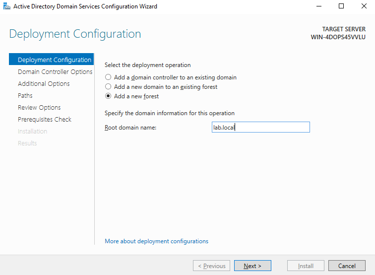

### Domain Controller Options

mot de passe DSRM défini ✅

### DNS Options

⚠️**Warning⚠️**

![[AD-DC-DNS-Options.png]]

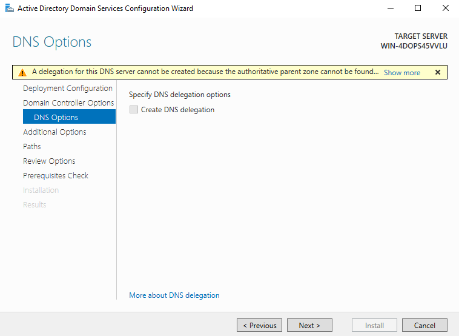

|Warning DNS|Action|
|---|---|
|Pas de délégation possible (pas de zone parent)|Ignoré, pas impact pour lab|
### Additional Options (NetBIOS name)

**A savoir**

| Élément                  | Exemple             | Rôle / Utilité                                                                            |
| ------------------------ | ------------------- | ----------------------------------------------------------------------------------------- |
| **FQDN**                 | `AD-DC01.lab.local` | Nom complet et unique dans le DNS, utilisé pour localiser serveurs, domaine, utilisateurs |
| **Nom de domaine (DNS)** | `lab.local`         | Namespace principal du domaine, utilisé pour logon, GPO, DNS                              |
| **NetBIOS**              | `LAB`               | Nom court historique, compatibilité anciens systèmes, format `LAB\User`                   |

**_FQDN : Fully Qualified Domain Name_**

### Installation terminée

|Élément|Statut / Info|
|---|---|
|Rôle installé|AD DS|
|DC promu|`lab.local`|
|DNS|Activé automatiquement|
|NetBIOS|`LAB`|
|Mot de passe DSRM|Défini|

![[AD-DC-Dashboard-after-install.png]]

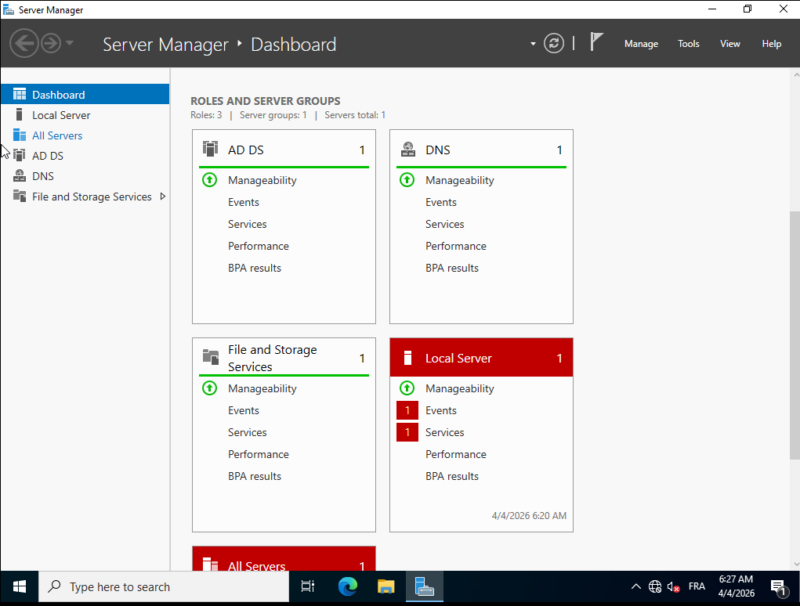


![[AD-DC-whoami.png]]

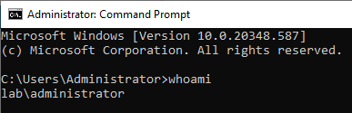

---
## Màj et Redémarrage DC

- En prod : planifié (nuit ou fenêtre de maintenance) + redondance (plusieurs DC)  
- Dans le lab : 1 seul DC → pas critique

---
## Créer un Utilisateur

- Server manager -> Tools -> Active Directory Users and Computers
- lab.local/Users -> New -> User

![[AD-DC-testuser.png]]

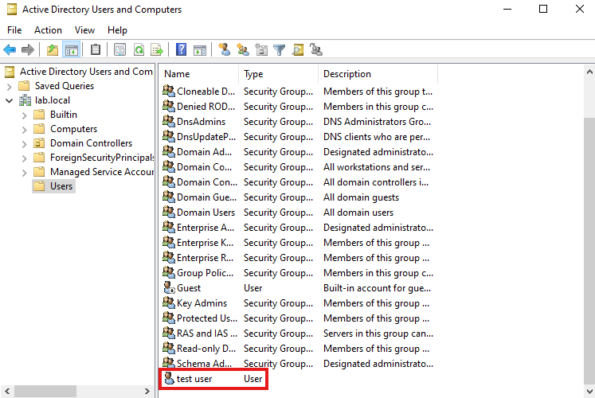

**Résultat** : L’utilisateur est créé dans Active Directory et peut se connecter sur n’importe quelle machine du domaine

---

## Création VM Windows 10 Pro
### Specs

![[WIN10 Specs.png]]

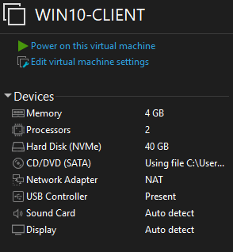

### Décisions d'installation

| Version | Domaine AD                         |
| ------- | ---------------------------------- |
| Home    | ❌ ne peut PAS rejoindre un domaine |
| Pro     | ✅ peut rejoindre un domaine        |

| Option         | Pourquoi                                                   |
| -------------- | ---------------------------------------------------------- |
| Personal use ✅ | Compte local simple → nécessaire pour rejoindre le domaine |
| Organization ❌ | Force compte Microsoft / Azure AD                          |

|Option|Usage|
|---|---|
|Offline account ✅|Crée un compte local → simple pour joindre domaine plus tard|
|Microsoft account ❌|Liaison en ligne, inutile pour lab AD|

### Problèmes / Solutions

| Problème                     | Solution                     |
| ---------------------------- | ---------------------------- |
| Easy Install → clé bloquante | VM Custom + Install OS later |
| EFI network timeout          | F2 → Boot CD/DVD first       |

---
## Configuration réseau Windows 10 Pro

![[WIN 10 IP settings.png]]

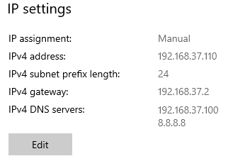

ping vers 192.168.37.100✅
ping vers lab.local ✅

---
## Joindre Windows 10 Pro au domaine lab.local

Settings -> About -> Rename This PC (Advanced) -> Change

![[WIN 10 into lab.local.png]]

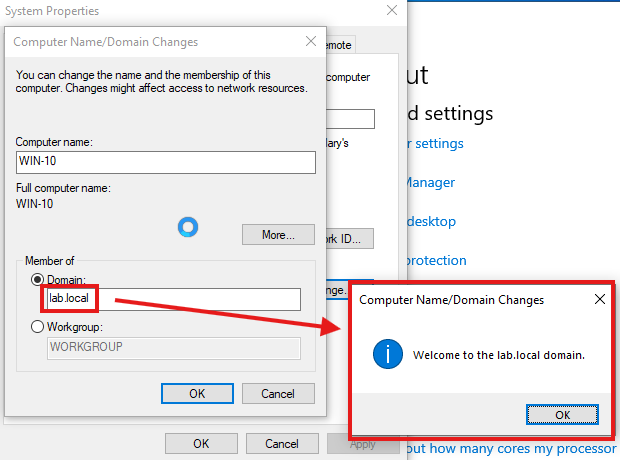

**Vérification dans AD**

![[WIN 10 dans AD.png]]

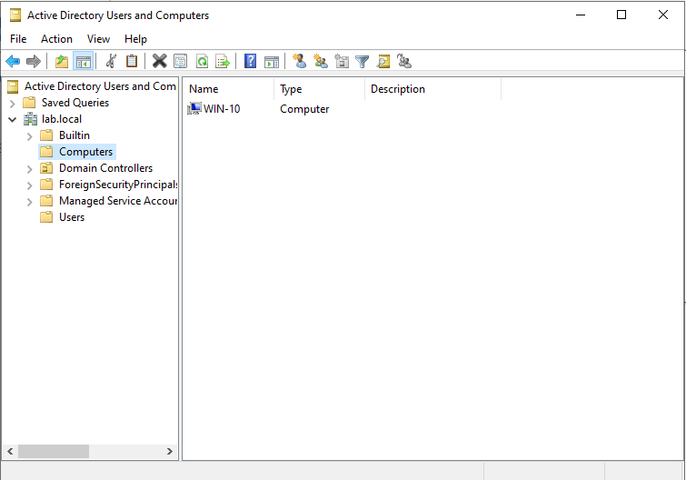

**Login test user sur WIN-10**

![[test user sur WIN-10.png]]

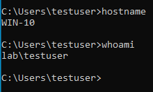

---
## Organisation Active Directory (OU + Groupes)

Création d’Unités d’Organisation (OU) et déplacement des objets dans les OUs :  

**Tools -> AD Users and Computers -> right clic on lab.local -> New -> Organizational Unit**

- OU_Users  
- OU_Computers  
- OU_IT  

![[AD-DC-OUs-Creates.png]]

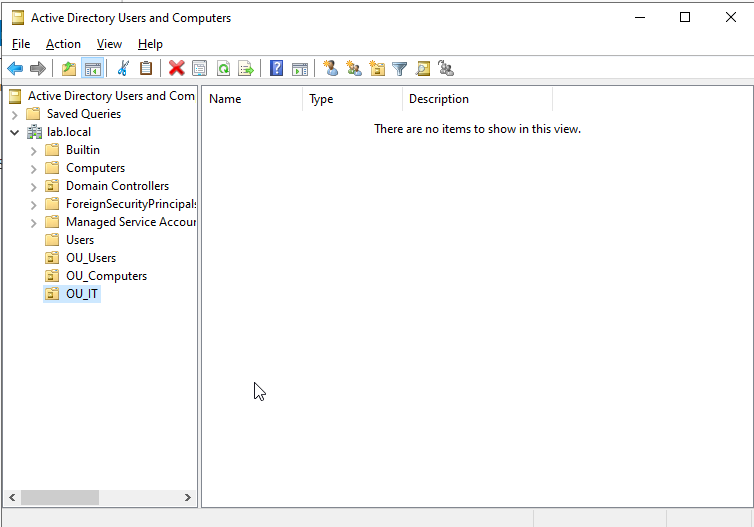

![[AD-DC-test-user-dans-OU_Users.png]]

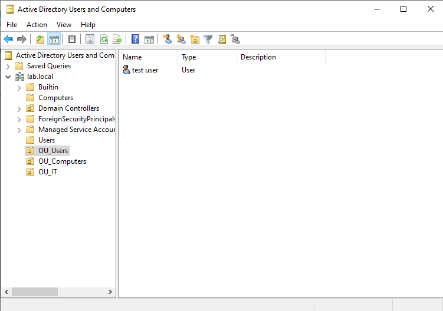

![[AD-DC-WIN-10-dans-OU_Computers.png]]

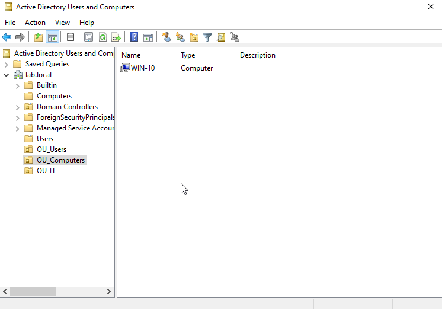

Objectif :  
- Structurer le domaine  
- Préparer l’application de GPO  
- Faciliter l’administration  
  
Remarque :  
- Les containers par défaut (Users, Computers) ne sont pas utilisés  
→ remplacement par des OU personnalisées

---
## Création d'un GPO pour OU_Computers

→ première politique appliquée sur les machines (forcer un fond d'écran)

Server Manager → Tools → Group Policy Management -> Forest → Domains → lab.local

![[AD-DC-create-a-GPO.png]]

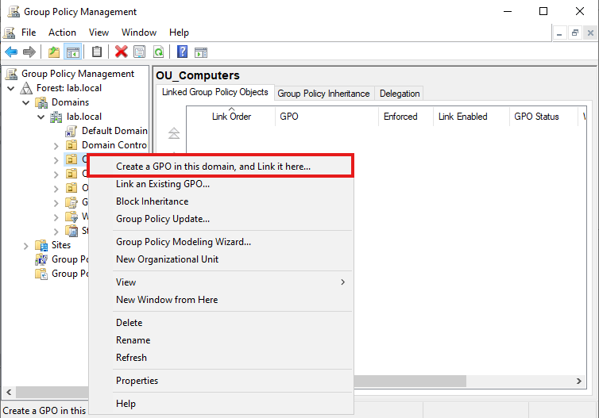

![[AD-DC-edit-GPO.png]]

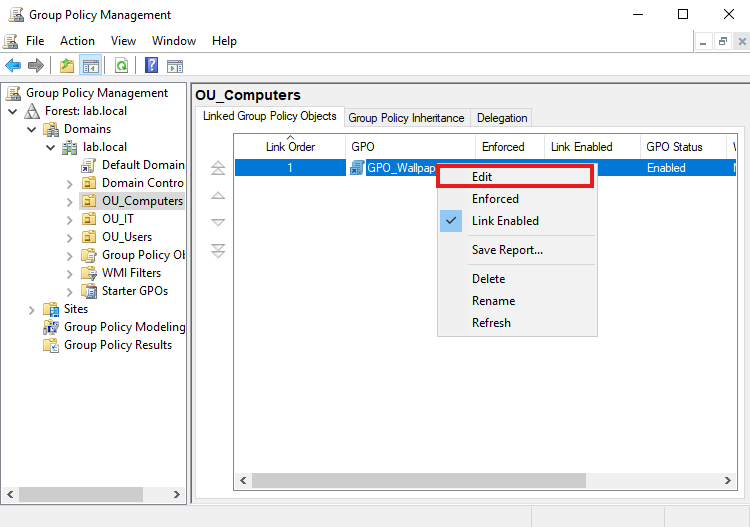

Clic droit sur `GPO_Wallpaper` → **Edit**

![[AD-DC-GPO-editor-Desktop-Wallpaper.png]]

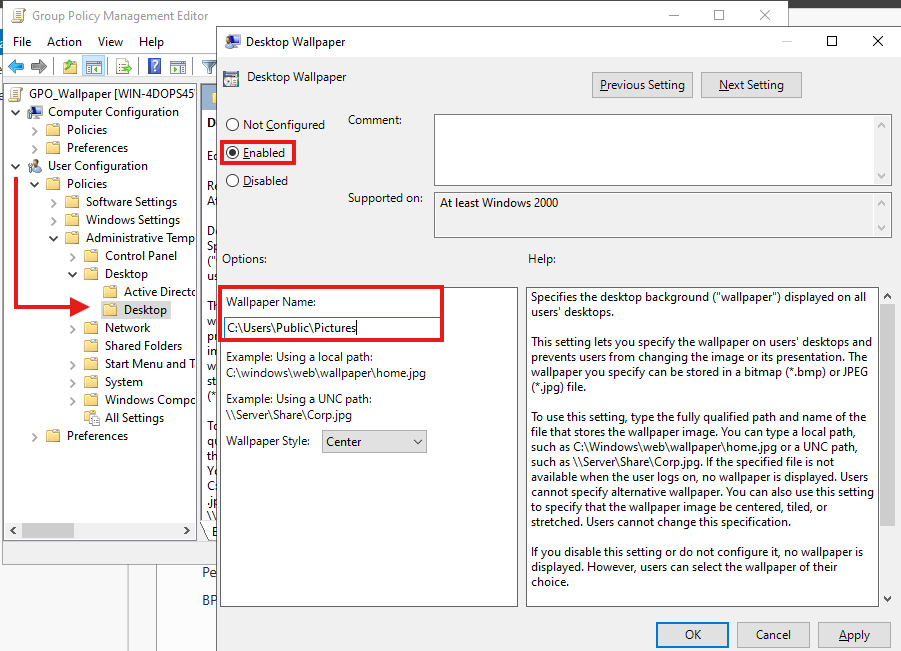

- **Enabled**
- Wallpaper path : chemin temporaire
- Style : Fill
- OK

### Rendre le wallpaper accessible

![[AD-DC-share-wallpapers.png]]

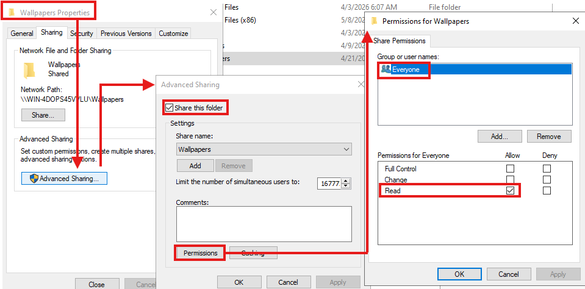

- Création dossier C:\Wallpapers
- Clic droit dossier → **Properties → Sharing → Advanced Sharing**
- Share this folder ✅
- Permissions : **Everyone → Read**
- Remplacement du chemin temporaire par le network path '\ \WIN-4DOPS45VVLU\Wallpapers\minecraft'

**Coté client WIN 10**

```cmd
gpudate \force
```

⚠️**Problème : le wallpaper n'a pas changé**⚠️

---
## Troubleshooting du GPO_Wallpaper

- GPO = User Configuration
- Link = OU_Computer

**-> Incompatibilité entre le type de GPO (User Configuration) et l’OU cible (Computers Configuration)**

![[AD-DC-Troubleshooting-GPO.png]]

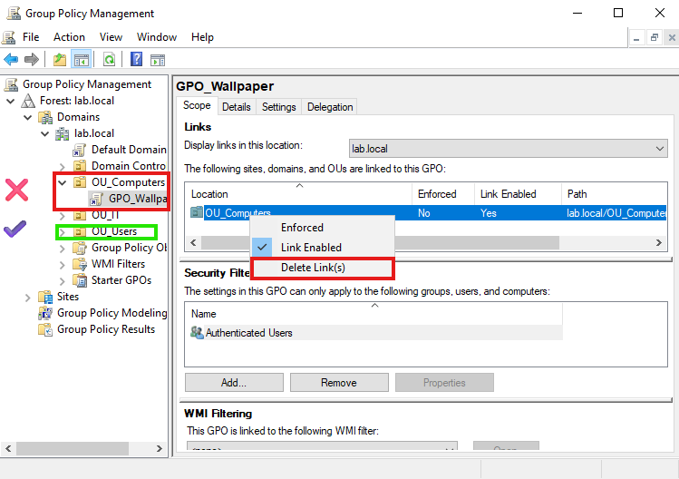

- Delete link OU_Computers
- OU_Users -> Link an Existing GPO... -> GPO_Wallpaper

![[AD-DC-Link-an-Existing-GPO.png]]

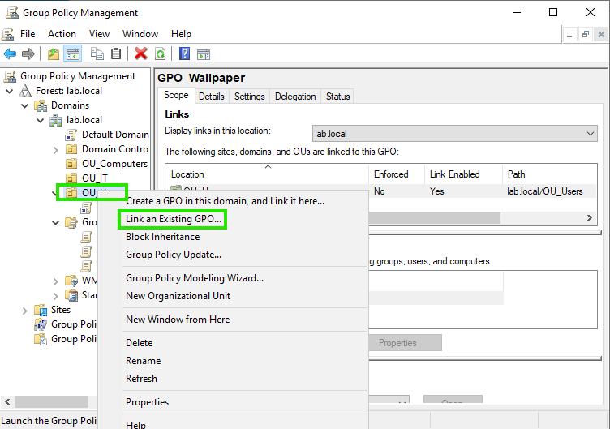

```cmd
gpupdate /force
```
- Logout / Login

⚠️**Fond d'écran noir**⚠️

- Rajouter l'extension du wallpaper minecraft.png dans le chemin '\ \WIN-4DOPS45VVLU\Wallpapers\minecraft'

```cmd
gpupdate /force
```
- Logout / Login

![[WIN10 wallpaper minecraft.png.png]]

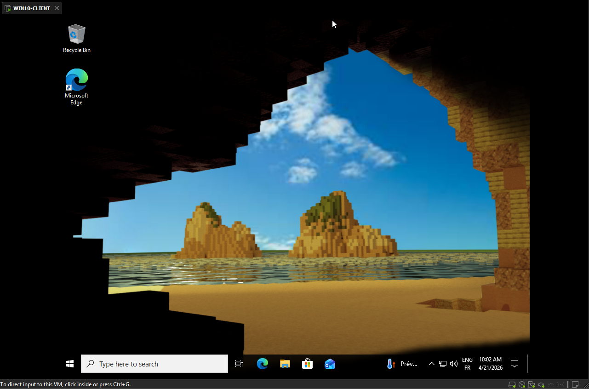

_PS : Le wallpaper vient du jeu Hytale et non Minecraft_

---
## Création de groupes AD

- OU_IT -> Right click -> New -> Group
- Création de IT_Admins & Users_Basic

![[AD Groups IT_Admins & Users_Basic.png]]

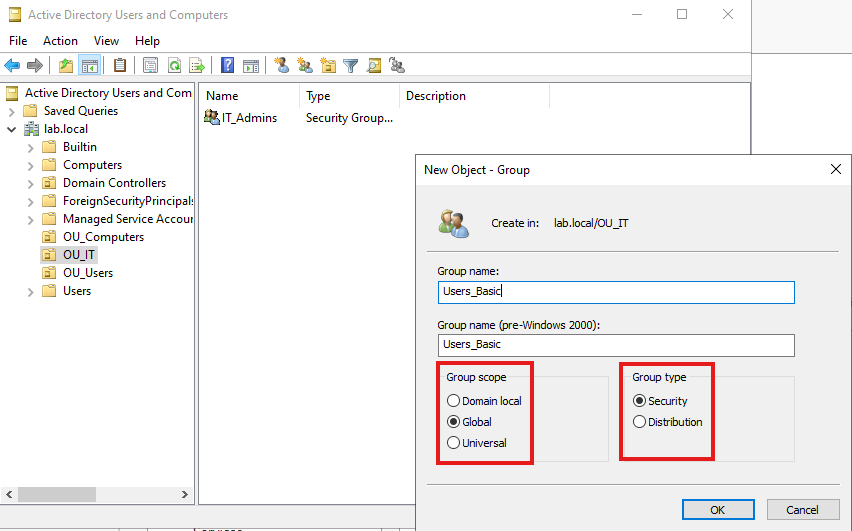

### Group Scope

| Type         | Description                                                  | Usage                                        |
| ------------ | ------------------------------------------------------------ | -------------------------------------------- |
| Domain Local | Utilisé pour donner des droits sur des ressources du domaine | Accès à des dossiers / partages              |
| Global       | Contient des utilisateurs du domaine                         | Regrouper des utilisateurs (le plus courant) |
| Universal    | Utilisé dans des environnements multi-domaines               | Cas avancés / grandes infra                  |

### Group Type

| Type         | Description                                         |
| ------------ | --------------------------------------------------- |
| Security     | Utilisé pour attribuer des permissions (recommandé) |
| Distribution | Utilisé pour des listes de diffusion (email)        |

### Bonne Pratique

→ Utiliser :  
- **Global + Security** pour regrouper les utilisateurs  
- **Domain Local + Security** pour gérer les permissions  
  
Principe :  
→ AGDLP (Accounts → Global → Domain Local → Permissions)

---
## Gestion des accès via groupes AD

### Partage Réseau

Création de C:\Partage -> Properties -> Sharing -> Advanced Sharing -> Share this folder -> Permissions -> Remove Everyone -> Add Users_Basic / Read only -> Apply

![[AD-gestion-des-accès-sur-Partage-Sharing.png]]

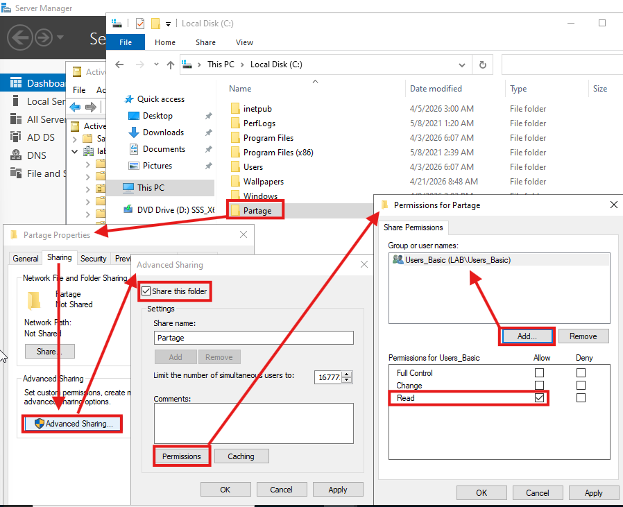

### Permissions NTFS

C:\Partage -> Properties -> Security -> Edit... -> Add Users_Basic -> Read / List folder contents / Read & execute -> Apply

![[AD-gestion-des-accès-sur-Partage-Security.png]]

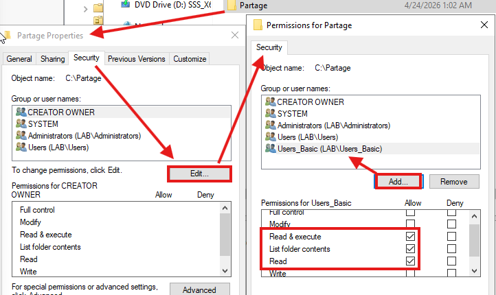

### Ajout de testuser dans Users_Basic

OU_Users -> Right click on test user -> Add to a Group -> Users_Basic

![[AD-add-test-user-to-Users_Basic.png]]

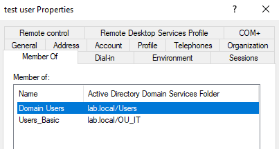

### Ordre des permissions Windows  
  
Lors de l’accès à un partage réseau, Windows combine :  
  
- Permissions de partage (Sharing)  
- Permissions NTFS (Security)

Le droit le plus restrictif est appliqué.

**Exemple :**

|Sharing|NTFS|Résultat|
|---|---|---|
|Read|Full Control|Read seulement ❌|
|Full Control|Read|Read seulement ❌|
|Read|Deny|Accès refusé ❌|

### Teste sur WIN 10 avec testuser

```cmd
gpupdate /force
```

Logout / Login

![[WIN 10 test du dossier Partage.png]]

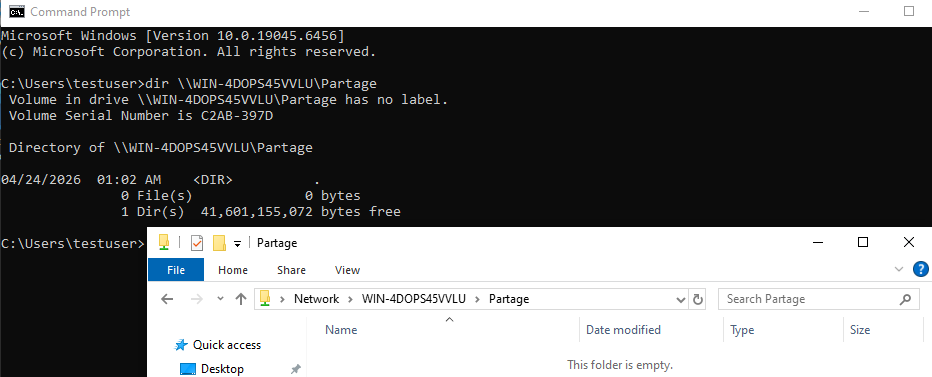

**Accès autorisé** ✅

---
## Password Policy

**Group Policy Management :**

Forest > Domains > lab.local > Right click on Default Domain Policy > Edit

**Group Poicy Management Editor :**

Computer Configuration > Policies > Windows Settings > Security Settings > Account Policies > Password Policy

![[AD Group Policy Management Editor - Password Policy.png]]

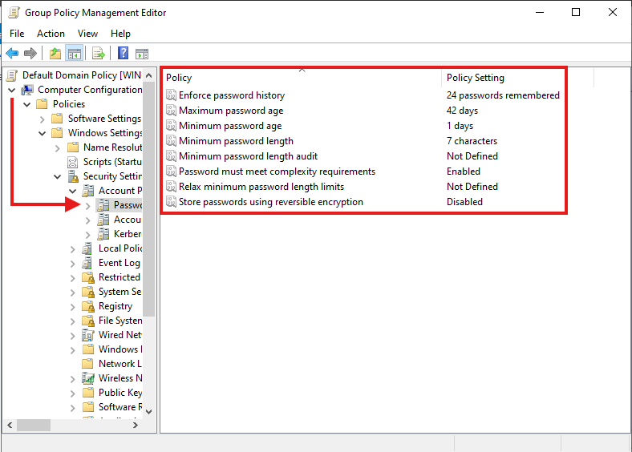

- longueur minimale : 8 caractères  
- complexité activée  
- expiration : 90 jours  
  
→ s’applique à tout le domaine

### Changement de MDP pour testuser

MDP : test1234

- 8 caractères ✅
- Complexité ❌

![[WIN 10 mdp test1234.png]]

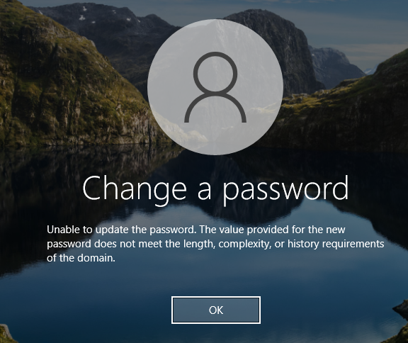

MDP : p@$W0rd

- 8 caractères ❌
- Complexité ✅

**Même message d'erreur**

MDP : p@sSv3RYs3CuR&

- 8 caractères ✅
- Complexité ✅

![[Win 10 mdp changed.png]]

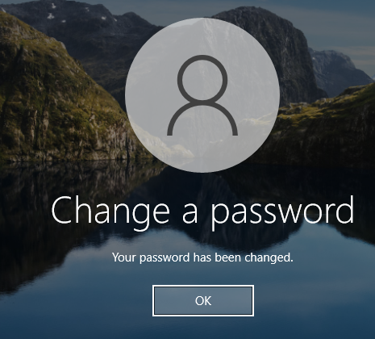

---
## GPO de restriction (cmd, panneau de configuration...)

**Group Policy Management**

Forest > Domains > lab.local > Right click OU_Users "Create GPO in this domain, link it here"

![[AD GPO_Restrictions.png]]

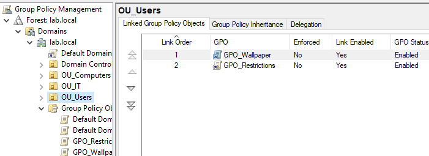

OU_Users : Cible les utilisateurs

**Group Policy Management Editor**

Right click on GPO_Restrictions > Edit > GP management editor

### Blocage CMD

User Configuration > Policies > Administrative Templates > System

![[AD prevent access to the command prompt.png]]

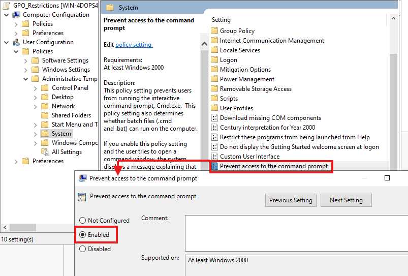

### Blocage panneau de configuration

User Configuration > Policies > Administrative Templates > Control Panel

![[AD prohibit access to control panel.png]]

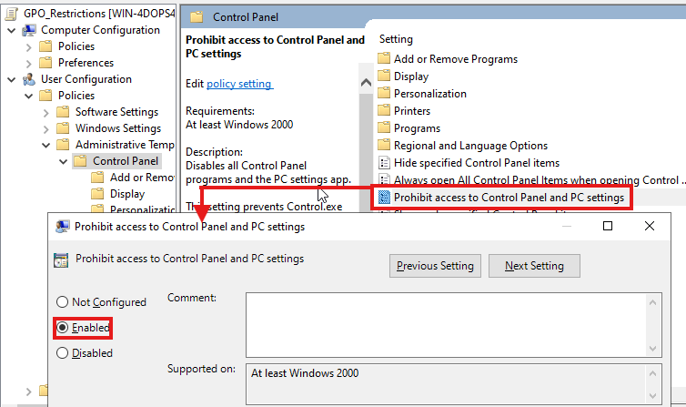

### Test du GPO sur testuser

**CMD**

![[WIN 10 cmd disabled.png]]

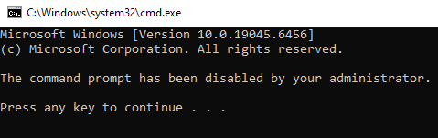

**Control Panel**

![[WIN 10 control panel disabled.png]]

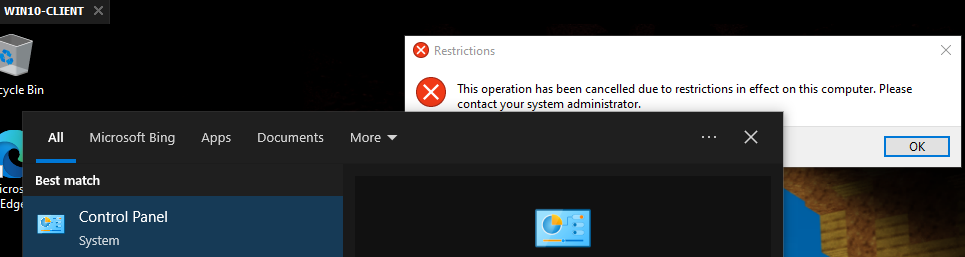

---
## Conclusion
### GPO mises en place

|Politique GPO|Objectif / impact|
|---|---|
|Restriction de l’invite de commande|Bloquer l’exécution de commandes pour limiter les scripts malveillants|
|Restriction du panneau de configuration|Empêcher les modifications système pour sécuriser la configuration|
|Politique de mot de passe|Renforcer l’authentification et réduire les risques de brute force|

### Améliorations possibles

* mise en place d’un SIEM
* collecte et analyse des logs
* détection des attaques (brute force)
* durcissement avancé

### Ce que j'ai appris

Ce projet m’a permis de mettre en pratique la gestion d’un environnement Active Directory et d’appliquer des premières mesures de sécurisation.

---
## Suite logique

Prochaine étape : mettre en place un SIEM dans le lab pour aller vers la détection et la réponse aux incidents.

### SIEM (Wazuh)

Déployer Wazuh pour :

- centraliser et analyser les logs Active Directory
- détecter les activités suspectes
- créer des alertes de sécurité
- monitorer les événements du domaine

### Défense

- installation serveur + agents Wazuh
- collecte des logs Windows / AD
- détection brute force et comportements anormaux
- gestion des alertes et incidents

### Attaques

- brute force sur comptes AD
- tentatives d’élévation de privilèges
- exécution de scripts malveillants
- génération d’événements pour test des détections
